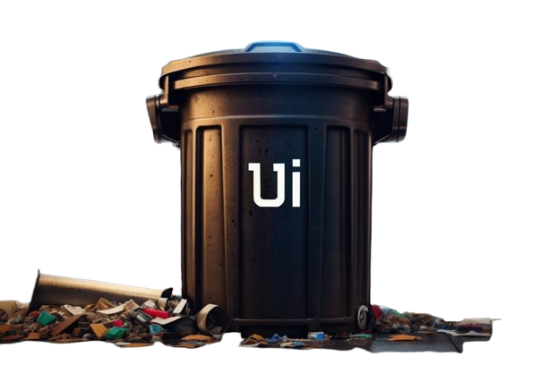

<!-- markdownlint-disable-next-line -->
<p align="center">
  <a href="https://github.com/Riteshp2001/UniqueTrashUi" rel="noopener" target="_blank"></a>
</p>

<h1 align="center">Unique Trash Ui</h1>

Choose your options with a grin! Our library introduces a collection of wacky selectors that add a dash of humor to user interactions. Embrace the chaos and let your users smile their way through forms.

## Getting Started

### Prerequisites

-   Node.js
-   npm

### Installation

1. Clone the repository:

```sh
git clone https://github.com/Riteshp2001/UniqueTrashUi.git
```

2. Navigate to the project directory:

```sh
cd UniqueTrashUi
```

3. Install the dependencies:

```sh
npm install
```

4. Start the development server to see Demo of the library in action:

```sh
npm run dev
```

### Usage

To use a component from this library, import it in your file:

```javascript
import { ButtonV1, RangeV1 } from "unique_trash_ui";
```

Then, you can use it in your React component:

```jsx
function App() {
	return (
		<div className="App">
			<ButtonV1 />
			<RangeV1 />
		</div>
	);
}

export default App;
```

### Development

To start the development server:

```sh
npm run dev
```

## Contributing

We are open to contributions. Please read [CONTRIBUTING](CONTRIBUTING.md) for details on our code of conduct, and the process for submitting pull requests to me.

## License

This project is licensed under the GNU License - see the [LICENSE](LICENSE) file for details.
